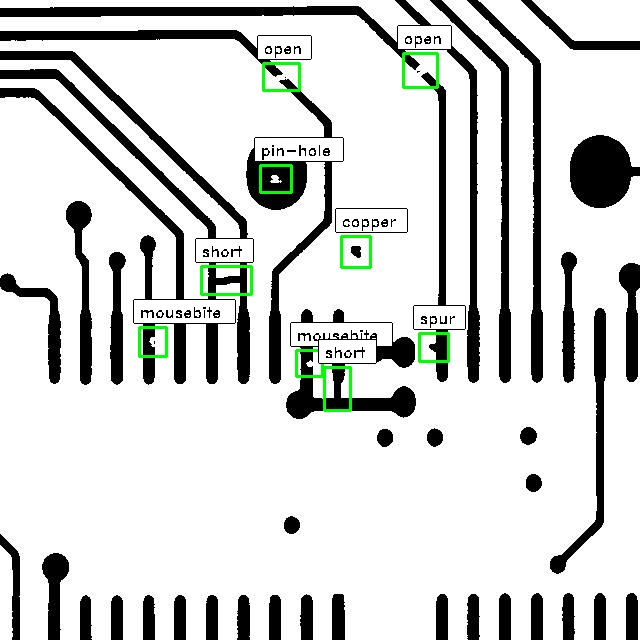

# PCB 缺陷检测对比实验

本项目基于 DeepPCB 数据，比较四种 PCB 缺陷检测方案：纯 YOLO、纯 Florence-2、OpenCV + YOLO，以及 OpenCV + Florence-2。

仓库中包含实验说明、评估工具和四组模型权重。完整数据集不上传至本仓库，需要时请从 [DeepPCB 原始项目](https://github.com/tangsanli5201/DeepPCB) 获取。

## 当前实验结果

以下数据是本项目统一采用的最终结果。权重、日志和预测文件仅作为实验存档，不用于反向修改这组数据。

| 排名 | 模型 | F1 | mAP@0.5 |
| ---: | --- | ---: | ---: |
| 1 | OpenCV + Florence-2 | **0.929** | **0.963** |
| 2 | OpenCV + YOLO | 0.855 | 0.911 |
| 3 | 纯 Florence-2 | 0.509 | 0.337 |
| 4 | 纯 YOLO | 0.361 | 0.180 |

综合检测性能排序如下：

> OpenCV + Florence-2 > OpenCV + YOLO > 纯 Florence-2 > 纯 YOLO

更完整的实验设计、参数和结果说明见 [PCB缺陷检测对比实验实施计划.md](./PCB缺陷检测对比实验实施计划.md)。

## 四组对比方案

### 1. 纯 YOLO

直接使用 YOLO 对输入图像进行缺陷检测，不增加传统图像处理步骤。该方案作为纯目标检测模型的基线。

### 2. 纯 Florence-2

直接使用 Florence-2 进行 PCB 缺陷检测，用于观察视觉语言模型独立处理该任务时的表现。

### 3. OpenCV + YOLO

先通过 OpenCV 完成图像配准、差分或区域增强，再由 YOLO 检测候选缺陷。OpenCV 预处理能够减少无关背景干扰。

### 4. OpenCV + Florence-2

先使用 OpenCV 提取和增强疑似缺陷区域，再交给 Florence-2 检测。该方案在当前四组实验中取得了最高的 F1 和 mAP@0.5。

## 权重目录

```text
weights/
├── yolo_original/
│   └── best.pt
├── yolo_opencv/
│   └── best.pt
├── florence_original/
│   └── best_adapter/
└── florence_opencv/
    └── best_adapter/
```

- `yolo_original`：纯 YOLO 权重。
- `yolo_opencv`：OpenCV + YOLO 权重。
- `florence_original`：纯 Florence-2 适配器权重与配置。
- `florence_opencv`：OpenCV + Florence-2 适配器权重与配置。

权重文件只能说明模型存档内容，不能单独作为最终实验指标的判定依据。

## DeepPCB 数据说明

DeepPCB 包含 1,500 对图像。每组数据由一张无缺陷模板图像和一张已配准的待测图像组成，并标注了六类常见 PCB 缺陷：

- 断路（open）
- 短路（short）
- 鼠咬（mousebite）
- 毛刺（spur）
- 针孔（pin-hole）
- 多余铜（spurious copper）

原始图像通过线阵 CCD 采集，分辨率约为每毫米 48 像素。原始模板图和待测图尺寸约为 16K × 16K，之后被裁剪为 640 × 640 的子图，并通过模板匹配完成配准。二值化等预处理用于降低光照变化带来的影响。

<div align="center">
  
  &nbsp;&nbsp;&nbsp;&nbsp;
  
</div>

<div align="center">
  左：带缺陷的待测图像；右：对应的无缺陷模板图像
</div>

> 本 GitHub 仓库不包含完整数据集，本地的 `PCBData/` 和 `datasets/` 目录已设置为不上传。

## 标注格式

每个缺陷使用与图像坐标轴平行的矩形框标注，并附带类别编号。标注文件与对应图像使用相同的文件名前缀，例如：

- `00041000_test.jpg`：待测图像。
- `00041000_temp.jpg`：模板图像。
- `00041000.txt`：对应的标注文件。

单个缺陷的标注格式为：

```text
x1,y1,x2,y2,type
```

其中 `(x1, y1)` 和 `(x2, y2)` 分别是缺陷框的左上角与右下角坐标，`type` 是类别编号：

| 编号 | 类别 |
| ---: | --- |
| 0 | 背景，不使用 |
| 1 | open |
| 2 | short |
| 3 | mousebite |
| 4 | spur |
| 5 | copper |
| 6 | pin-hole |

标注工具源码位于 `tools/PCBAnnotationTool/`。

## 评估方法

项目使用 F1 和 mAP 评价检测效果。原始 DeepPCB 评估中，当预测框与同类别真实框的 IoU 大于 0.33 时，该检测被判定为正确。

F1 的计算公式为：

```text
F1 = 2 × Precision × Recall / (Precision + Recall)
```

待评估预测文件中的每一行应采用以下格式：

```text
x1,y1,x2,y2,confidence,type
```

其中 `confidence` 为置信度，`type` 应为 `open`、`short`、`mousebite`、`spur`、`copper` 或 `pin-hole`。逗号之间不要添加空格。

将全部预测文本文件直接压缩为 `res.zip`，不要在压缩包中保留子目录，然后在 `evaluation/` 目录中运行：

```bash
python script.py -s=res.zip -g=gt.zip
```

## 项目结构

```text
DeepPCB/
├── README.md                         # 中文项目说明
├── PCB缺陷检测对比实验实施计划.md      # 对比实验方案与结果
├── evaluation/                       # 评估脚本与评估标注
├── fig/                              # README 示例图片
├── tools/                            # PCB 标注工具
└── weights/                          # 四组模型权重与配置
```

## 使用说明

- 本仓库未上传完整训练集和测试集。
- 使用权重前，请确认本地代码、依赖版本和模型结构与训练环境一致。
- Florence-2 目录保存的是适配器文件，使用时还需要准备对应的基础模型。
- 最终实验结论以本 README 和实验实施计划中记录的数据为准。

## 数据来源与许可

DeepPCB 数据来源于论文 *On-line PCB Defect Detector On A New PCB Defect Dataset* 及其公开仓库。原数据集仅用于研究用途，使用时请遵循原项目的许可要求。
